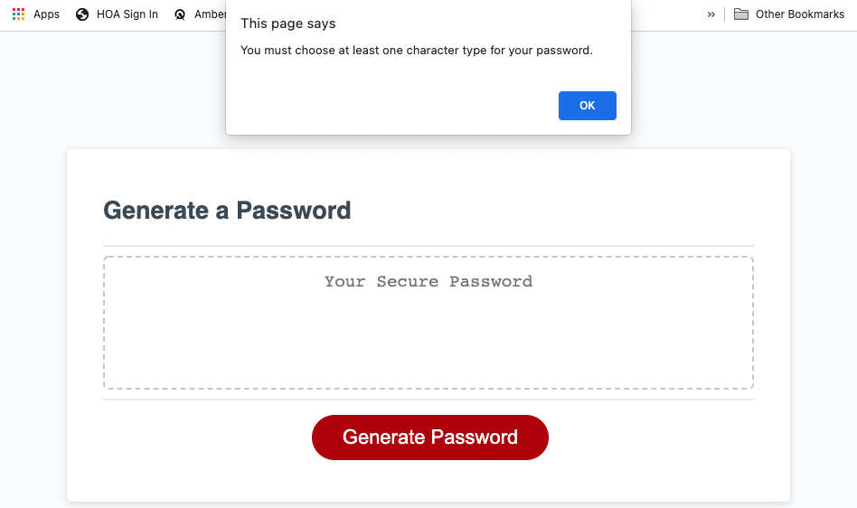
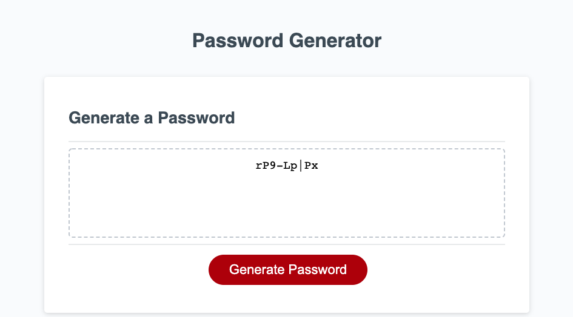

# Secure Password Generator

## Description
This is a password generator. The user is able to choose how long the password is (between 8-128 characters), and they can choose if they want to include lowercase letters, uppercase letters, numbers and/or special characters in the password.

This project was difficult. Coding the JavaScript for this project helped me better understand the language, and I reviewed the online lessons to remind myself how to write each piece of the function. 

I was able to psuedocode the majority of the project. I knew how to ask the user for their desired password length, and I understood how to check to make sure that they met the length requirement.

I understood how to ask the user if they wanted each type of character. At this point, I attended office hours on May 14, 2022, and one of the teaching assistants helped me to clean up my code using do-while loops. I apprecited learning this from him. 

The last part of the project was to actually generate the password, and I didn't know how to proceed. I researched arrays and objects. I knew that I would need to use Math.random() to get a random assortment of characters, and I suspected that I had to use a for loop. But, I didn't know how these things would fit together. The examples and ideas I found in my research didn't make sense to me. They seemed more complicated than what I learned from the module.

I signed up for my first session with a tutor. On May 15, 2022, Meg Meyers helped me code and understand how to generate the password.

I ended up using arrays to store all of the characters that would be needed to generate the password. I created two additional blank arrays. The first is used to create a "new" set of characters to choose randomly from using the next if statements. This way whatever assortment of characters the user chooses can be easily accessed. 

The second blank array holds one character of each of the types chosen by the user.

Then I added a for statement to fill in the remaining characters needed to reach the password length chosen by the user.

The last part of the function returns the password, which then is written into the form on the screen.

I learned a lot from this project. I think the most important thing I learned is how to read JavaScript. Now I better understand how the computer reads the code I wrote.

## Installation
In order to access this repository, the user needs to close it from GitHub using the command git clone git@github.com:kaylab78/secure-password-generator.git in their command line interface.

## Usage
When the user clicks the "Generate Password" button, a series of prompts appear. The first asks the user how long they want the password to be.

If the user chooses a number less than 8 or greater than 128, they are asked to choose a new number.

After the user chooses a number between 8 and 128, they are asked if they want to include lowercase letters in their password. They need to click "OK" or "Cancel."

Once the user makes a decision about using lowercase letters, they will receive similar, separate messages asking if they want to include uppercase letters, numbers and/or special characters. Each question is a new dialogue box.

If the user selects "Cancel" for all four of these questions, they will be asked to make at least one choice out of the four.

When the user clicks "OK," they receive the first message asking if they want to use lowercase letters in the password. They will then receive the three remaining messages in the same order as the first time.

Once they are done choosing what types of characters they want in their password, the password will appear on the form. In this password will be at least one of each type of character that the user chose to be in their password.

Example:

If the user needs a new password, they can click on the "Generate Password" button to run through the same prompts.

## Credits
The original code for this project was cloned from Xandromus at [https://github.com/coding-boot-camp/friendly-parakeet](https://github.com/coding-boot-camp/friendly-parakeet).

Thank you to class teaching assistant Chris Stallcup for his assistance during office hours on May 14, 2022. He helped me understand do-while loops and redirected me (and my code) in some spots to make my code easier to understand.

Thank you to bootcamp tutor Meg Meyers for helping me on May 15, 2022, to understand how to generate the password using arrays.

The wording for the license on this project is from the MIT License outlined [here](https://choosealicense.com/licenses/mit/).

## License
Copyright (c) 2022 Kayla Backus

Permission is hereby granted, free of charge, to any person obtaining a copy of this software and associated documentation files (the "Software"), to deal in the Software without restriction, including without limitation the rights to use, copy, modify, merge, publish, distribute, sublicense, and/or sell copies of the Software, and to permit persons to whom the Software is furnished to do so, subject to the following conditions:

The above copyright notice and this permission notice shall be included in all copies or substantial portions of the Software.

THE SOFTWARE IS PROVIDED "AS IS", WITHOUT WARRANTY OF ANY KIND, EXPRESS OR IMPLIED, INCLUDING BUT NOT LIMITED TO THE WARRANTIES OF MERCHANTABILITY, FITNESS FOR A PARTICULAR PURPOSE AND NONINFRINGEMENT. IN NO EVENT SHALL THE AUTHORS OR COPYRIGHT HOLDERS BE LIABLE FOR ANY CLAIM, DAMAGES OR OTHER LIABILITY, WHETHER IN AN ACTION OF CONTRACT, TORT OR OTHERWISE, ARISING FROM, OUT OF OR IN CONNECTION WITH THE SOFTWARE OR THE USE OR OTHER DEALINGS IN THE SOFTWARE.