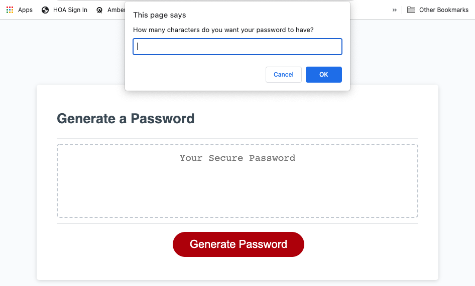
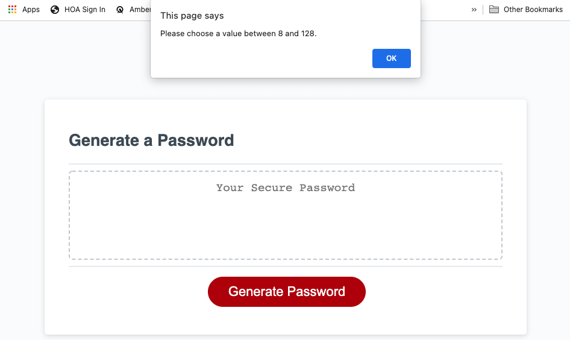
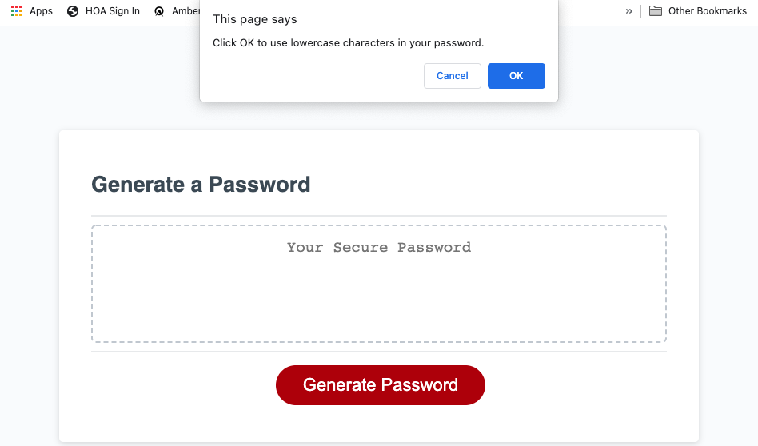

# Secure Password Generator

## Description
This is a password generator. The user is able to choose how long the password is (between 8-128 characters), and they can choose if they want to include lowercase letters, uppercase letters, numbers and/or special characters in the password.

## Installation
In order to access this repository, the user needs to close it from GitHub using the command git clone git@github.com:kaylab78/secure-password-generator.git in their command line interface.

## Usage
When the user clicks the "Generate Password" button, a series of prompts appear. The first asks the user how long they want the password to be.

If the user chooses a number below 8 or over 128, they are asked to choose a new number.

After the user chooses a number between 8 and 128, they are asked if they want to include lowercase letters in their password. They need to click "OK" or "Cancel."

Once the user makes a decision about using lowercase letters, they will receive the similar messages asking if they want to include uppercase letters, numbers and/or special characters. Each question is a new dialogue box.

## Credits
The original code for this project was cloned from Xandromus at [https://github.com/coding-boot-camp/friendly-parakeet](https://github.com/coding-boot-camp/friendly-parakeet).

Thank you to class teaching assistant Chris Stallcup for his assistance during office hours on May 14. He helped me understand do-while loops and redirected me (and my code) in some spots to make my code easier to understand.

Thank you to bootcamp tutor Meg Meyers for helping me to understand how to generate the password using arrays.

The wording for the license on this project is from the MIT License outlined [here](https://choosealicense.com/licenses/mit/).

## License
Copyright (c) 2022 Kayla Backus

Permission is hereby granted, free of charge, to any person obtaining a copy of this software and associated documentation files (the "Software"), to deal in the Software without restriction, including without limitation the rights to use, copy, modify, merge, publish, distribute, sublicense, and/or sell copies of the Software, and to permit persons to whom the Software is furnished to do so, subject to the following conditions:

The above copyright notice and this permission notice shall be included in all copies or substantial portions of the Software.

THE SOFTWARE IS PROVIDED "AS IS", WITHOUT WARRANTY OF ANY KIND, EXPRESS OR IMPLIED, INCLUDING BUT NOT LIMITED TO THE WARRANTIES OF MERCHANTABILITY, FITNESS FOR A PARTICULAR PURPOSE AND NONINFRINGEMENT. IN NO EVENT SHALL THE AUTHORS OR COPYRIGHT HOLDERS BE LIABLE FOR ANY CLAIM, DAMAGES OR OTHER LIABILITY, WHETHER IN AN ACTION OF CONTRACT, TORT OR OTHERWISE, ARISING FROM, OUT OF OR IN CONNECTION WITH THE SOFTWARE OR THE USE OR OTHER DEALINGS IN THE SOFTWARE.